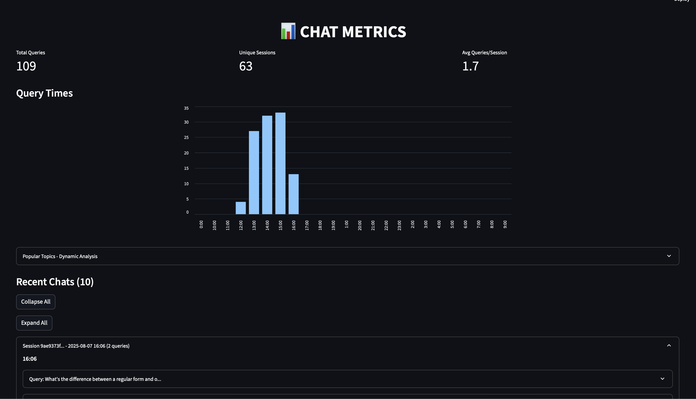

# 🎓 Humboldt State University Research Office Chatbot

> An AI-powered chatbot integrated with Humboldt State University's research website (humboldt.edu/research) to help users quickly find information and navigate complex research procedures. Built with AWS Bedrock and DynamoDB for intelligent document retrieval and 24/7 availability.

## ✨ Features

- 🌐 **Website Navigation Assistant** - Helps users navigate humboldt.edu/research with natural language queries
- 🤖 **24/7 Availability** - Provides instant answers to research-related questions anytime
- 📚 **Document Processing** - Accesses and processes university website content and resources
- 💬 **Natural Language Processing** - Understands complex research procedure questions
- 📊 **Staff Workload Reduction** - Automates responses to routine inquiries
- 🎯 **Smart Routing** - Directs users to appropriate sections and escalates when needed
- 📈 **Usage Analytics** - Identifies common question patterns for website improvement
- 🔄 **Session Management** - Maintains conversation context across interactions

## 🏗️ Architecture

```
┌─────────────────┐    ┌──────────────────┐    ┌─────────────────┐
│   Streamlit     │    │   AWS Bedrock    │    │   DynamoDB      │
│   Frontend      │◄──►│   Knowledge Base │◄──►│   Analytics     │
└─────────────────┘    └──────────────────┘    └─────────────────┘
                                 ▲
                                 │
                       ┌──────────────────┐
                       │ Humboldt.edu     │
                       │ Research Site    │
                       └──────────────────┘
```

## 🚀 Quick Start

### Prerequisites

- Python 3.8+
- AWS Account with Bedrock access
- DynamoDB table configured
- Knowledge Base populated with Humboldt research website content
- Access to humboldt.edu/research content and documentation

### Installation

1. **Clone the repository**
   ```bash
   git clone <your-repo-url>
   cd humbolt-research-chatbot
   ```

2. **Install dependencies**
   ```bash
   pip install -r requirements.txt
   ```

3. **Configure environment variables**
   ```bash
   cp .env.example .env
   # Edit .env with your AWS credentials and configuration
   ```

4. **Run the application**
   ```bash
   # Main chatbot interface
   streamlit run app.py
   
   # Analytics dashboard
   streamlit run dashboard.py
   ```

## ⚙️ Configuration

Create a `.env` file with the following variables:

```env
AWS_ACCESS_KEY_ID=your_access_key
AWS_SECRET_ACCESS_KEY=your_secret_key
AWS_SESSION_TOKEN=your_session_token
AWS_DEFAULT_REGION=us-west-2
KNOWLEDGE_BASE_ID=your_kb_id
BEDROCK_MODEL_ID=anthropic.claude-3-5-sonnet-20241022-v2:0
DYNAMODB_TABLE_NAME=your-dynamodb-table
```

## 📱 Usage

### Main Chat Interface (`app.py`)
- Ask questions about research procedures and policies
- Get instant navigation help for the research website
- Receive step-by-step guidance for complex processes
- Access information 24/7 without waiting for staff
- View source citations from official university resources


### Analytics Dashboard (`dashboard.py`)
- Monitor chat usage metrics and user engagement
- Identify most common research questions and pain points
- Track staff workload reduction through automation
- Analyze website navigation patterns for improvement
- Generate reports for research office administration


## 🛠️ Components

### Core Files

| File | Purpose |
|------|---------|
| `app.py` | Main chatbot interface with RAG functionality |
| `dashboard.py` | Analytics and monitoring dashboard |
| `requirements.txt` | Python dependencies |
| `.env` | Environment configuration |

### Key Features

- **University-Specific Knowledge**: Trained on Humboldt research website content
- **Procedure Guidance**: Step-by-step workflows for research processes
- **Smart Escalation**: Routes complex queries to appropriate staff members
- **Multi-User Support**: Serves faculty, students, and staff simultaneously
- **Source Citation**: Links back to official university resources and policies

## 📊 Dashboard Metrics

The analytics dashboard provides:

- 📈 **Total Queries** - Track chatbot usage and adoption
- 👥 **User Categories** - Faculty, student, and staff engagement
- ⚠️ **Escalation Rate** - Questions requiring human intervention
- ⏰ **Peak Usage Times** - Optimize staff availability
- 🔥 **Common Pain Points** - Identify website improvement opportunities
- 📞 **Staff Workload Reduction** - Measure automation impact

## 🔧 AWS Services Used

- **Amazon Bedrock** - Foundation models and knowledge base
- **DynamoDB** - Chat history storage and analytics
- **IAM** - Access management and security

## 🤝 Contributing

1. Fork the repository
2. Create a feature branch (`git checkout -b feature/amazing-feature`)
3. Commit your changes (`git commit -m 'Add amazing feature'`)
4. Push to the branch (`git push origin feature/amazing-feature`)
5. Open a Pull Request

## 🆘 Support

For questions or issues:
- 📧 Create an issue in this repository
- 💬 Check existing discussions
- 📖 Review the AWS Bedrock documentation

## 🎯 Roadmap

- [ ] Integration with university authentication system
- [ ] Mobile-responsive design for campus users
- [ ] Advanced analytics for website redesign insights
- [ ] Multi-language support for international researchers
- [ ] API endpoints for future university system integration
- [ ] Automated content updates from website sources
- [ ] Enhanced escalation workflows to research office staff

## 🎓 Target Users

- **Faculty** - Research funding, compliance, and procedure questions
- **Students** - Research opportunities and application procedures
- **Staff** - Administrative processes and policy clarifications
- **Developers** - Analytics provided for website improvements

## 👥 Collaborators

- **Christiana Razafindrasoa**
- **Heaven Nichols** 
- **Adrian Li** 
- **Brooklynn Gullickson** 
- **Joel Taroreh** 

---

Made with ❤️ for Humboldt State University Research Community during CCC AI Summer Camp